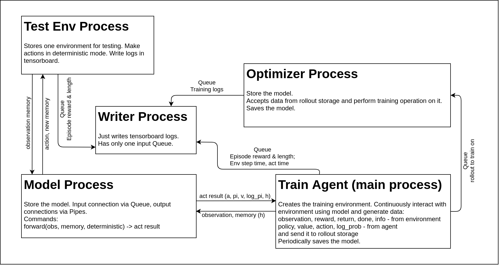

### Parallelism description

There is 4 total processes run in parallel:
1. Model process - accepts inputs via queue and send result into pipes.
Train and test agents send observation into it and receive actions from to execute in environment.
2. Optimizer process - it has an input queue where the data gathering process puts new rollouts.
When new rollout becomes available for optimizer - it performs training.
If training is slower than rollout gathering - the queue will be clogged (because queue is a FIFO data structure)
and optimizer will perform training on old rollouts, gathered by previous policy,
so on-policy training will be violated.
3. Tensorboard writer process - it continuously writing tensorboard logs acquired
from optimizer or data gatherer.
4. Optional test process. It continuously interact with environment using current policy,
it is helpful to watch training online. Also it can plot performance of a deterministic version of the policy.

And one 'TrainAgent' which runs in the main python process.
It is responsible for gathering rollouts and send them into optimizer.
It manages rollout gathering and all nn-environment interactions:
* creating pool of parallel executed environments, 
* computing action (via sending observation into model and receiving action from it),
* executing action in environment,
* resetting done environments and model memory (for recurrent policies)
* sending environment statistics into tensorboard writer
* storing gathered rollout and sending it to the optimizer
* sending 'save' command to optimizer every epoch

### Processes scheme

