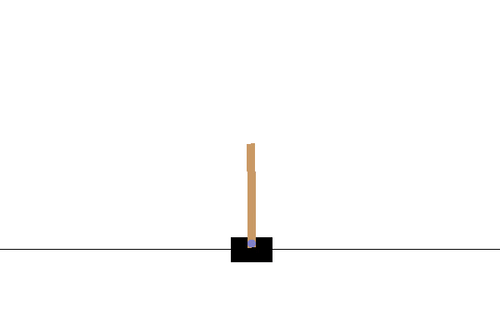

# PyTorch Reinforcement and Imitation Learning

This repository contains parallel PyTorch implementation of some Reinforcement and Imitation Learning algorithms:
A2C, PPO, BCO, GAIL, V-trace. Short description:
- Advantage Actor-Critic (A2C) - a synchronous variant of [*A3C*](https://arxiv.org/abs/1602.01783)
- Proximal Policy Optimization (PPO) - one of the most popular RL algorithms [*PPO*](https://arxiv.org/abs/1707.06347), 
                               [*Truly PPO*](https://arxiv.org/abs/1903.07940), 
                               [*Implementation Matters*](https://arxiv.org/abs/2005.12729), 
                               [*A Large-Scale Empirical Study of PPO*](https://arxiv.org/abs/2006.05990)
- Behavioral Cloning from Observation (BCO) - technique to clone expert behavior into agent using only expert states,
                                              [*BCO*](https://arxiv.org/abs/1805.01954)
- Generative Adversarial Imitation Learning (GAIL) - algorithm to mimic expert policy using discriminator as reward model
                                              [*GAIL*](https://arxiv.org/abs/1606.03476)

Each algorithm supports vector/image/dict observation spaces and discrete/continuous/tuple action spaces.
Data gathering and training on it controlled by separate processes,
parallelism scheme is described in [this file](cherry_rl/algorithms/parallel/readme.md).
Code is written with a focus on on-policy algorithms;
Recurrent policies are also supported.

## Current Functionality

Each algorithm supports discrete (Categorical, Bernoulli, GumbelSoftmax)
and continuous (Beta, Normal, tanh(Normal)) policy distributions,
and there is additional 'Tuple' distribution that can be used for mixing distributions above. 
For continuous action spaces, Beta distribution works best in my experiments
(tested on BipedalWalker and Humanoid environments).

Environments with vector, image, or dict observation spaces are supported.
Recurrent policies are supported.

Several returns estimation algorithms supported: 1-step, n-step, [*GAE*](https://arxiv.org/abs/1506.02438) and
V-Trace (Introduced in [*IMPALA*](https://arxiv.org/abs/1802.01561) paper).

As found in paper [*Implementation Matters*](https://arxiv.org/abs/2005.12729), 
PPO algo works mostly because of "code-level" optimizations. Here I implemented most of them:
- [x] Value function clipping (works better without it)
- [x] Observation normalization & clipping
- [x] Reward normalization/scaling & clipping
- [x] Orthogonal initialization of neural network weights
- [x] Gradient clipping
- [ ] Learning rate annealing (will be added... sometime)

In addition, I implemented roll-back loss from [*Truly PPO paper*](https://arxiv.org/abs/1903.07940), which works well.

## How to use

Clone the repo, install python module:
```bash
git clone https://github.com/CherryPieSexy/imitation_learning.git
cd imitation_learning/
pip install -e .
```

#### Training example

Each experiment is described in a config, look at the [config](configs/cart_pole/cart_pole_ppo_annotated.py).
To run the experiment execute the command:
```bash
python configs/cart_pole/cart_pole_ppo_annotated.py
```

Training results (including training config, tensorboard logs, and model checkpoints) will be saved in the ```log_dir``` folder.

Obtained policy: 



#### Testing example
Results of trained policy may be shown with ```cherry_rl/test.py``` script. To run in from any folder execute:
```bash
python -m cherry_rl.test -f ${PATH_TO_LOG_DIR} -p ${CHECKPOINT_ID}
```
This script is able to: 
- just show how policy acts in the environment
- measure mean reward and episode len over a requested number of episodes
- record demo file with trajectories

Execute ```python -m cherry_rl.test -h``` to see a detailed description of available arguments.

#### Code structure
    .
    ├── cherry_rl                        # folder with code
        ├── algorithms                      # algorithmic part of code
            ├── nn                          # folder with neural networks definitions.
                ├── agent_model.py          # special module for the agent.
                └── ...                     # various nn models: actor-critics, convolutional & recurrent encoders.
            ├── optimizers                  # folder with RL optimizers. Each optimizer shares
                ├── model_optimizer.py      # base optimizer for all models.
                ├── actor_critic_optimizer.py
                └── ...                     # core algorithms: a2c.py, ppo.py, bco.py
            ├── parallel
                ├── readme.md               # description of used parallelism scheme
                └── ...                     # modules responsible for parallel rollout gathering and training.
            ├── returns_estimator.py        # special module for estimating returns. Supported estimators: 
            └── ...                         # all other algorithmic modules that do not fit in any other folder. 
        ├── utils
            ├── vec_env.py                  # vector env (copy of OpenAI code, but w/o automatic resetting)
            └── ...                         # environment wrappers and other utils.
        └── test.py                         # script for watching trained agent and recording demo.
    ├── configs                             # subfolder name = environment, script name = algo
        ├── cart_pole
            ├── cart_pole_demo_10_ep.pickle  # demo file for training BCO or GAIL
            ├── cart_pole_a2c.py
            ├── cart_pole_ppo.py
            ├── cart_pole_ppo_gru.py        # recurrent policy
            ├── cart_pole_ppo_annotated.py  # ppo training script with comments
            ├── cart_pole_bco.py
            └── cart_pole_gail.py
        ├── bipedal                         # folder with similar scripts as cart_pole
        ├── humanoid
        └── car_racing

#### Modular neural network definition
Each agent have optional ```make_obs_encoder``` and ```obs_normalizer_size``` arguments.
Observation encoder is a neural network (i.e. nn.Module), it is applied directly to observation, typically an image.
Observation normalizer is a running mean-variance estimator which standardizes observations, it applied _before_ encoder. 
Most of the times actor-critic trains better on such zero-mean unit-variance observations or embeddings.

To train your own neural network architecture you can just import or define it in the config, 
initialize it in ```make_ac_model``` function, and pass as ```make_actor_critic``` argument into ```AgentModel```.

#### Trained environments
GIFs of some of the results:

BipedalWalker-v3: mean reward ~333, 0 fails over 1000 episodes, [config](configs/bipedal/bipedal_ppo.py).


Humanoid-v3: mean reward ~11.3k, 14 fails over 1000 episodes, [config](configs/humanoid/humanoid_ppo.py).


Experiments with Humanoid done in mujoco v2 
which have integration bug that makes the environment easier. For academic purposes, it is correct to use mujoco v1.5

CarRacing-v0: mean reward = 894 ± 32, 26 fails over 100 episodes 
(episode is considered failed if reward < 900), 
[config](configs/car_racing/car_racing_ppo.py).


## Further plans
- Try Motion Imitation [*DeepMimic paper*](https://arxiv.org/abs/1804.02717) algo
- Add self-play trainer with PPO as backbone algo
- ...
